# Verifications after Android R8 proguard strips log

The expected results in the bytecode:
-   All of the logger calls are removed.
-   All of the log messages, which are string concatenation, are removed.
-   (better) All of the custom logger instances are removed.


Verification flow:
-   Android Studio "Build > Analyze APK... > Select Path"
-   check the bytecode with the naked eye

For easy understanding and concise screenshots with the full context, I use d2j-dex2jar 2.1 and Luyten 0.8.2 ([more info](#java-decompiler-gui)) to facilitate illustrations instead of using complete bytecode screenshots. Also, I show the key bytecode snippets.


## Java

commit 0a514e54

[MainActivity](../app/src/main/java/com/alletsxlab/proguardstripslog/MainActivity.java)

[BaseActivity](../app/src/main/java/com/alletsxlab/proguardstripslog/base/BaseActivity.java)

[LogUtil](../app/src/main/java/com/alletsxlab/proguardstripslog/utils/LogUtil.java)


### not proguard

`MainActivity`:

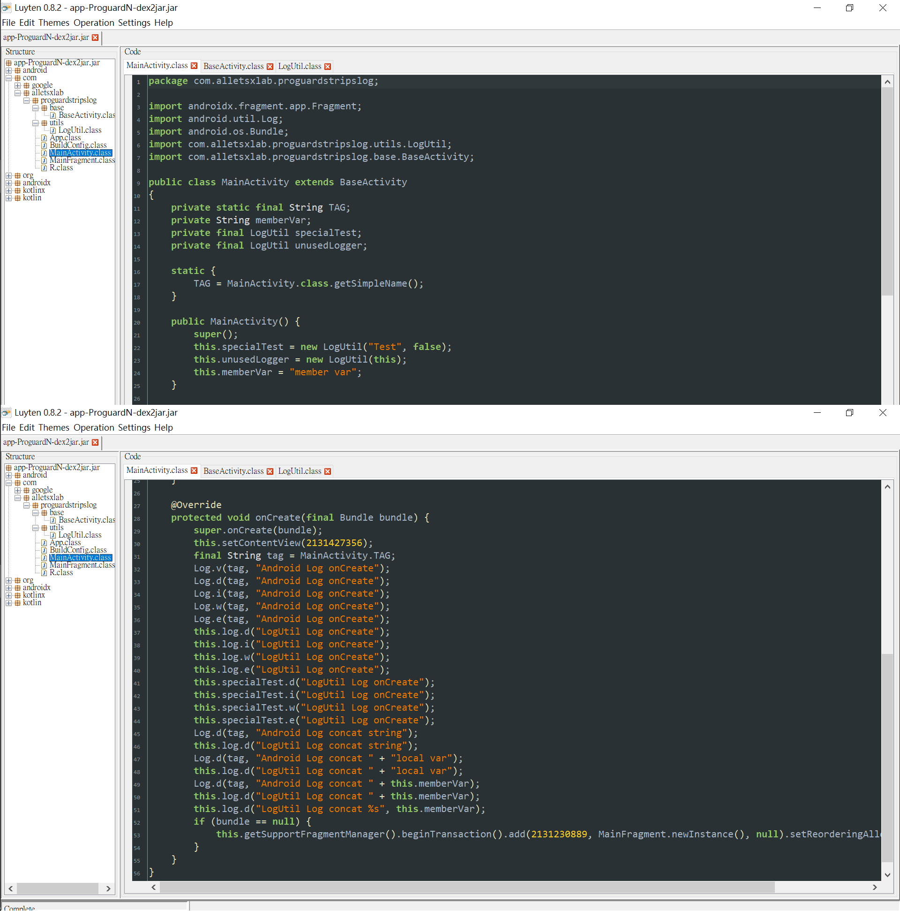

`BaseActivity`:

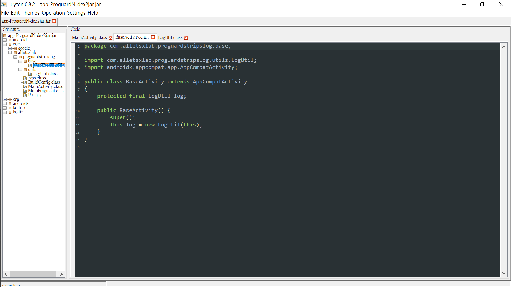

`LogUtil`:

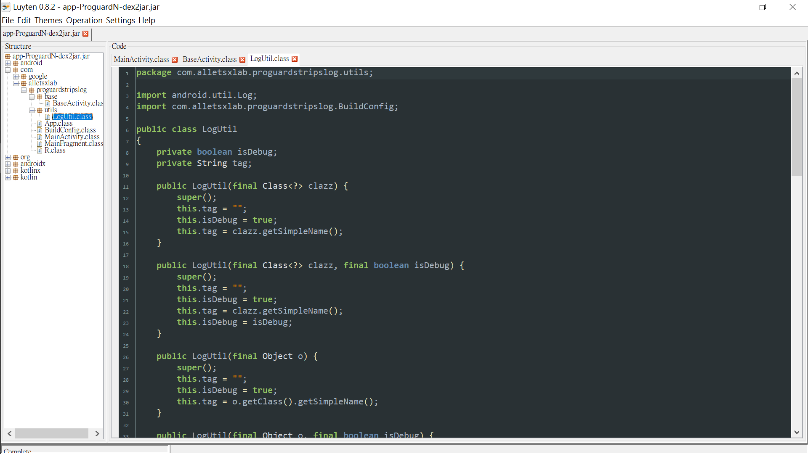


### proguard

-   R8 strips the custom logger instance `unusedLogger`.


`MainActivity`:

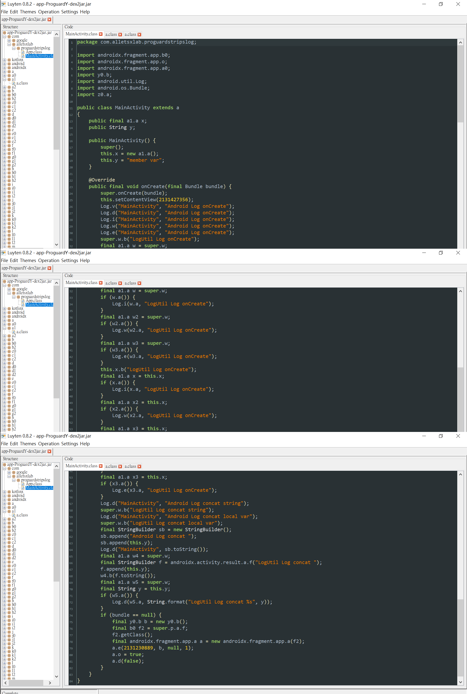

`BaseActivity`:


`LogUtil`:

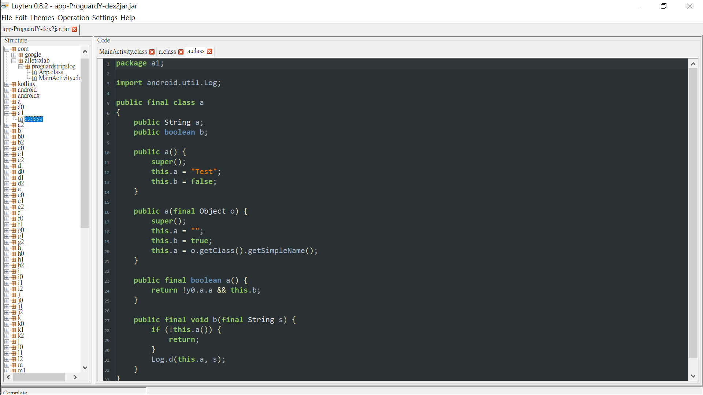


### proguard with rules

-   R8 strips all of the log statements and the custom logger instances.


**Some of the blank lines with line number in the following bytecode snippets have been stripped manually.**

`MainActivity`:

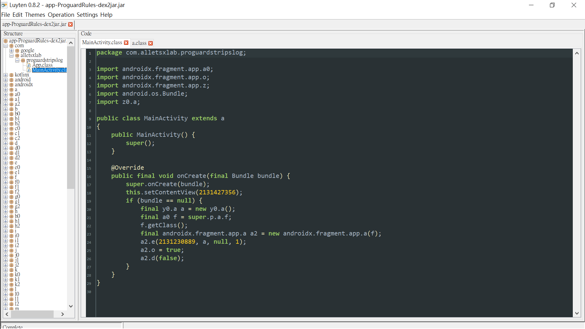

`MainActivity.onCreate()` bytecode:

```
.method public final onCreate(Landroid/os/Bundle;)V
    .registers 6

    .line 1
    invoke-super {p0, p1}, Landroidx/fragment/app/q;->onCreate(Landroid/os/Bundle;)V

    .line 2
    .line 3
    .line 4
    const v0, 0x7f0b001c

    .line 5
    .line 6
    .line 7
    invoke-virtual {p0, v0}, Ld/g;->setContentView(I)V

    .line 8
    .line 9
    .line 10
    if-nez p1, :cond_2c

    .line 11
    .line 12
    new-instance p1, Ly0/a;

    .line 13
    .line 14
    invoke-direct {p1}, Ly0/a;-><init>()V

    .line 15
    .line 16
    .line 17
    iget-object v0, p0, Landroidx/fragment/app/q;->p:Landroidx/fragment/app/t;

    .line 18
    .line 19
    iget-object v0, v0, Landroidx/fragment/app/t;->a:Landroidx/fragment/app/v;

    .line 20
    .line 21
    iget-object v0, v0, Landroidx/fragment/app/v;->f:Landroidx/fragment/app/a0;

    .line 22
    .line 23
    invoke-virtual {v0}, Ljava/lang/Object;->getClass()Ljava/lang/Class;

    .line 24
    .line 25
    .line 26
    new-instance v1, Landroidx/fragment/app/a;

    .line 27
    .line 28
    invoke-direct {v1, v0}, Landroidx/fragment/app/a;-><init>(Landroidx/fragment/app/z;)V

    .line 29
    .line 30
    .line 31
    const v0, 0x7f0800a9

    .line 32
    .line 33
    .line 34
    const/4 v2, 0x0

    .line 35
    const/4 v3, 0x1

    .line 36
    invoke-virtual {v1, v0, p1, v2, v3}, Landroidx/fragment/app/a;->e(ILandroidx/fragment/app/o;Ljava/lang/String;I)V

    .line 37
    .line 38
    .line 39
    iput-boolean v3, v1, Landroidx/fragment/app/g0;->o:Z

    .line 40
    .line 41
    const/4 p1, 0x0

    .line 42
    invoke-virtual {v1, p1}, Landroidx/fragment/app/a;->d(Z)I

    .line 43
    .line 44
    .line 45
    :cond_2c
    return-void
.end method
```

`BaseActivity`:

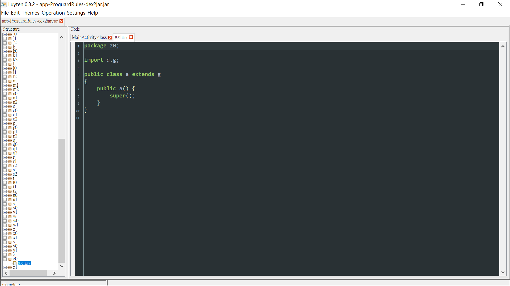

`BaseActivity` bytecode:

```
.class public Lz0/a;
.super Ld/g;
.source "SourceFile"


# direct methods
.method public constructor <init>()V
    .registers 1

    invoke-direct {p0}, Ld/g;-><init>()V

    return-void
.end method
```


## Kotlin

commit 0a514e54

[MainActivity](../appkt/src/main/java/com/alletsxlab/proguardstripslog/MainActivity.kt)

[BaseActivity](../appkt/src/main/java/com/alletsxlab/proguardstripslog/base/BaseActivity.kt)

[LogUtil](../appkt/src/main/java/com/alletsxlab/proguardstripslog/utils/LogUtil.kt)


### not proguard

`MainActivity`:


`BaseActivity`:

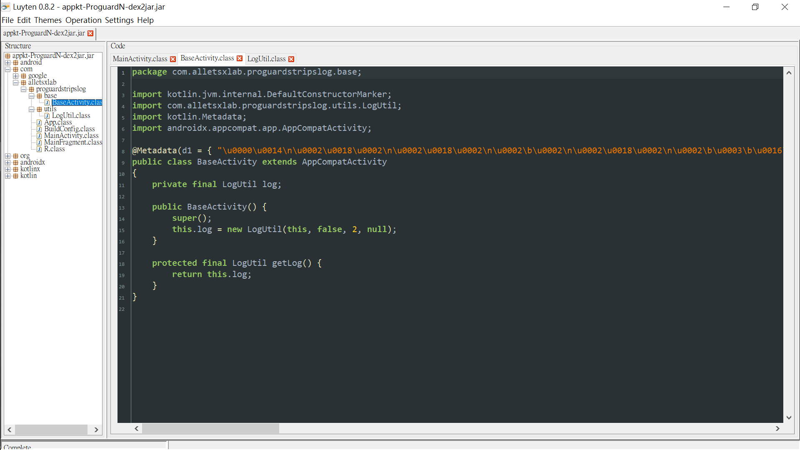

`LogUtil`:

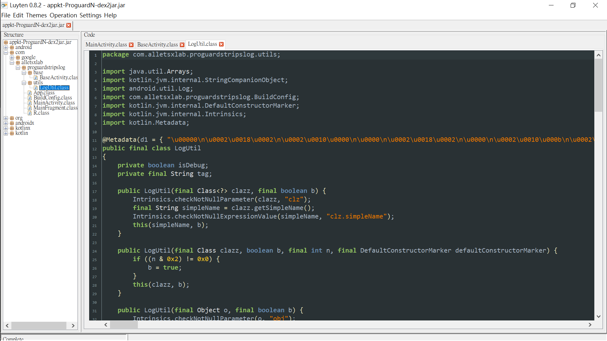


### proguard

-   R8 strips the custom logger instance `unusedLogger`.


`MainActivity`:

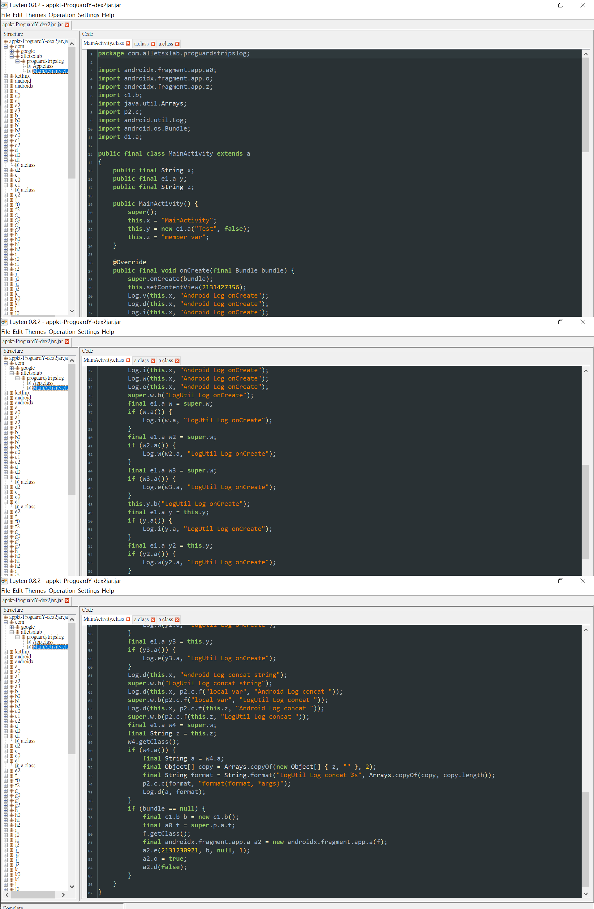

`BaseActivity`:

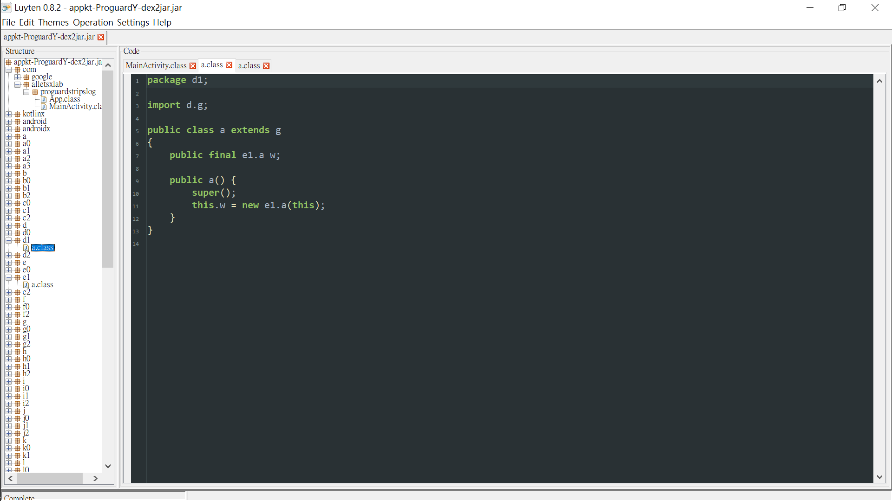

`LogUtil`:

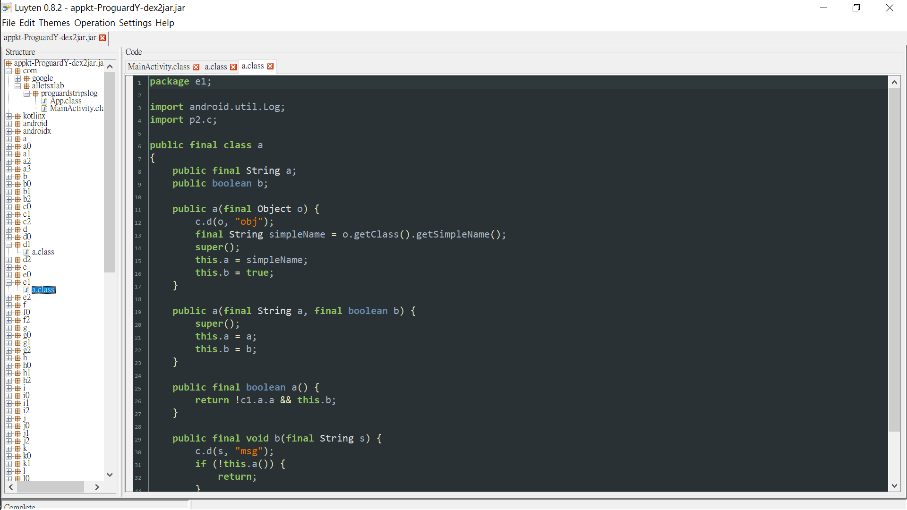


### proguard with rules

-   R8 strips most of the log statements,
	but it leaves unused string concatenation.
-   R8 strips all of the custom logger instances.


**Some of the blank lines with line number in the following bytecode snippets have been stripped manually.**

`MainActivity`:

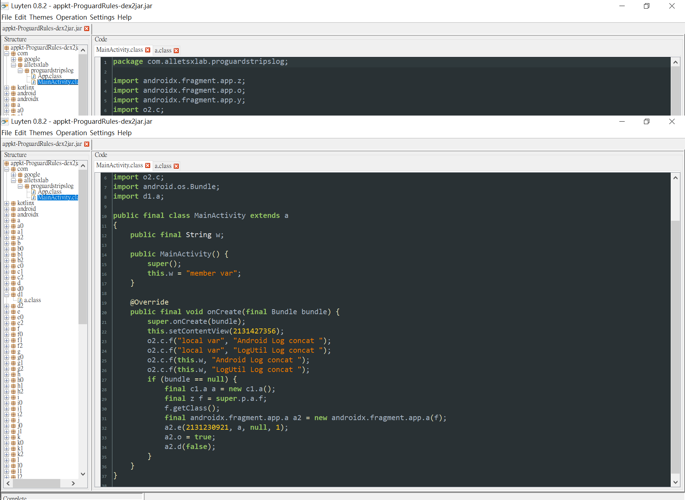

`MainActivity.onCreate()` bytecode:

```
.method public final onCreate(Landroid/os/Bundle;)V
    .registers 6

    .line 1
    invoke-super {p0, p1}, Landroidx/fragment/app/p;->onCreate(Landroid/os/Bundle;)V

    .line 2
    .line 3
    .line 4
    const v0, 0x7f0b001c

    .line 5
    .line 6
    .line 7
    invoke-virtual {p0, v0}, Ld/g;->setContentView(I)V

    .line 8
    .line 9
    .line 10
    const-string v0, "local var"

    .line 11
    .line 12
    const-string v1, "Android Log concat "

    .line 13
    .line 14
    invoke-static {v0, v1}, Lo2/c;->f(Ljava/lang/Object;Ljava/lang/String;)Ljava/lang/String;

    .line 15
    .line 16
    .line 17
    const-string v2, "LogUtil Log concat "

    .line 18
    .line 19
    invoke-static {v0, v2}, Lo2/c;->f(Ljava/lang/Object;Ljava/lang/String;)Ljava/lang/String;

    .line 20
    .line 21
    .line 22
    iget-object v0, p0, Lcom/alletsxlab/proguardstripslog/MainActivity;->w:Ljava/lang/String;

    .line 23
    .line 24
    invoke-static {v0, v1}, Lo2/c;->f(Ljava/lang/Object;Ljava/lang/String;)Ljava/lang/String;

    .line 25
    .line 26
    .line 27
    iget-object v0, p0, Lcom/alletsxlab/proguardstripslog/MainActivity;->w:Ljava/lang/String;

    .line 28
    .line 29
    invoke-static {v0, v2}, Lo2/c;->f(Ljava/lang/Object;Ljava/lang/String;)Ljava/lang/String;

    .line 30
    .line 31
    .line 32
    if-nez p1, :cond_42

    .line 33
    .line 34
    new-instance p1, Lc1/a;

    .line 35
    .line 36
    invoke-direct {p1}, Lc1/a;-><init>()V

    .line 37
    .line 38
    .line 39
    iget-object v0, p0, Landroidx/fragment/app/p;->p:Landroidx/fragment/app/r;

    .line 40
    .line 41
    iget-object v0, v0, Landroidx/fragment/app/r;->a:Landroidx/fragment/app/t;

    .line 42
    .line 43
    iget-object v0, v0, Landroidx/fragment/app/t;->f:Landroidx/fragment/app/z;

    .line 44
    .line 45
    invoke-virtual {v0}, Ljava/lang/Object;->getClass()Ljava/lang/Class;

    .line 46
    .line 47
    .line 48
    new-instance v1, Landroidx/fragment/app/a;

    .line 49
    .line 50
    invoke-direct {v1, v0}, Landroidx/fragment/app/a;-><init>(Landroidx/fragment/app/y;)V

    .line 51
    .line 52
    .line 53
    const v0, 0x7f0800c9

    .line 54
    .line 55
    .line 56
    const/4 v2, 0x0

    .line 57
    const/4 v3, 0x1

    .line 58
    invoke-virtual {v1, v0, p1, v2, v3}, Landroidx/fragment/app/a;->e(ILandroidx/fragment/app/o;Ljava/lang/String;I)V

    .line 59
    .line 60
    .line 61
    iput-boolean v3, v1, Landroidx/fragment/app/f0;->o:Z

    .line 62
    .line 63
    const/4 p1, 0x0

    .line 64
    invoke-virtual {v1, p1}, Landroidx/fragment/app/a;->d(Z)I

    .line 65
    .line 66
    .line 67
    :cond_42
    return-void
.end method
```

`BaseActivity`:


`BaseActivity` bytecode:

```
.class public Ld1/a;
.super Ld/g;
.source "SourceFile"


# direct methods
.method public constructor <init>()V
    .registers 1

    invoke-direct {p0}, Ld/g;-><init>()V

    return-void
.end method
```


## Java Decompiler GUI

-   d2j-dex2jar 2.1, [Luyten 0.8.2](https://github.com/ThexXTURBOXx/Luyten/releases)
	-   [Luyten 0.5.4 (The original project is NOT entirely dead. Just resting.)](https://github.com/deathmarine/Luyten)
-   d2j-dex2jar 2.1, jd-gui 1.6.6


jd-gui can not often decompile code correctly.


I change to mainly use Luyten 0.8.2.
It can jump to declaration, display line numbers.

More, I have tried [jadx-gui 1.4.4](https://github.com/skylot/jadx/releases).
There are more useful features to work more efficiently.
For example, it can decompile Dex to Java.
However, it does too much code restructuring to result in fidelity loss.
The following is a example of string concatenation.

```
// expected result
final StringBuilder sb = new StringBuilder();
sb.append("Android Log concat ");
sb.append("local var");
Log.d(tag, sb.toString());

// jadx-gui 1.4.4
Log.d(str, "Android Log concat local var");
```


