# Verifications after Android R8 proguard strips log

The expected results in the bytecode:
-   All of the logger calls are removed.
-   All of the log messages, which are string concatenation, are removed.
-   (better) All of the custom logger instances are removed.


Verification flow:
-   Android Studio "Build > Analyze APK... > Select Path"
-   check the bytecode with the naked eye

For easy understanding and concise screenshots with the full context, I use d2j-dex2jar 2.1 and Luyten 0.8.2 ([more info](#java-decompiler-gui)) to facilitate illustrations instead of using complete bytecode screenshots. Also, I show the key bytecode snippets.


## Java

commit 439a0463

[MainActivity](../app/src/main/java/com/alletsxlab/proguardstripslog/MainActivity.java)

[BaseActivity](../app/src/main/java/com/alletsxlab/proguardstripslog/base/BaseActivity.java)

[LogUtil](../app/src/main/java/com/alletsxlab/proguardstripslog/utils/LogUtil.java)


### not proguard

`MainActivity`:

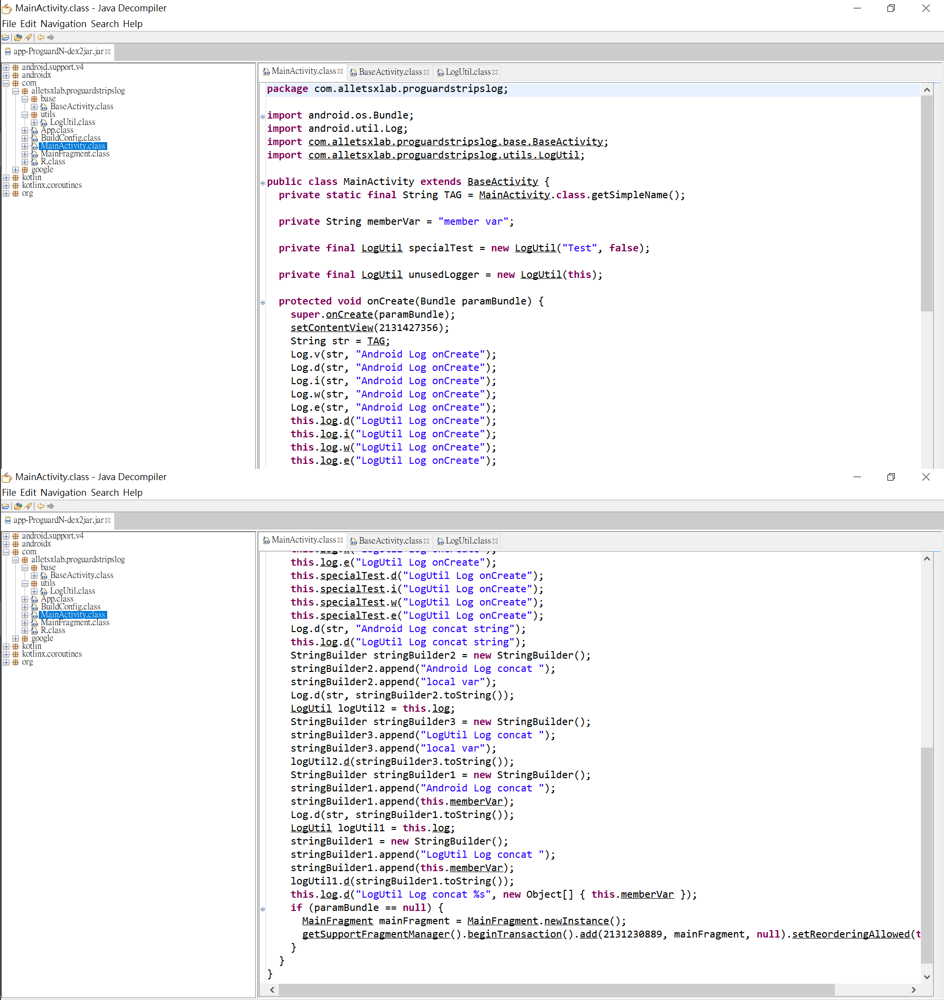

`BaseActivity`:

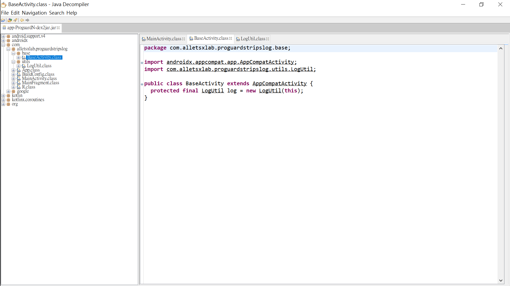

`LogUtil`:

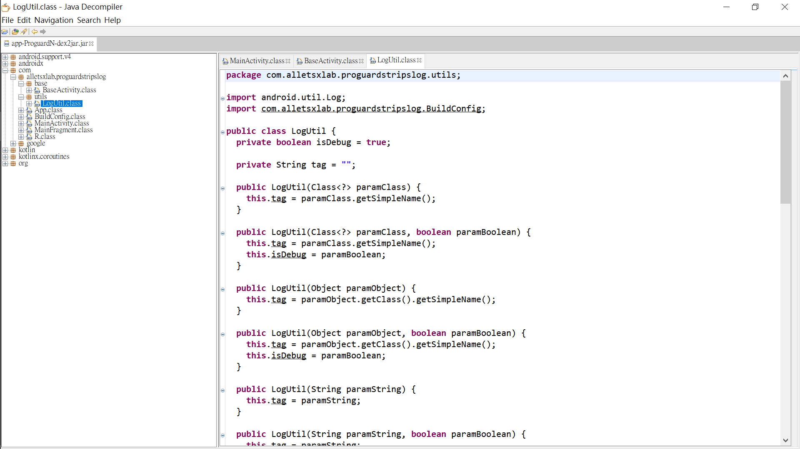


### proguard

-   R8 strips the custom logger instance `unusedLogger`.


`MainActivity`:

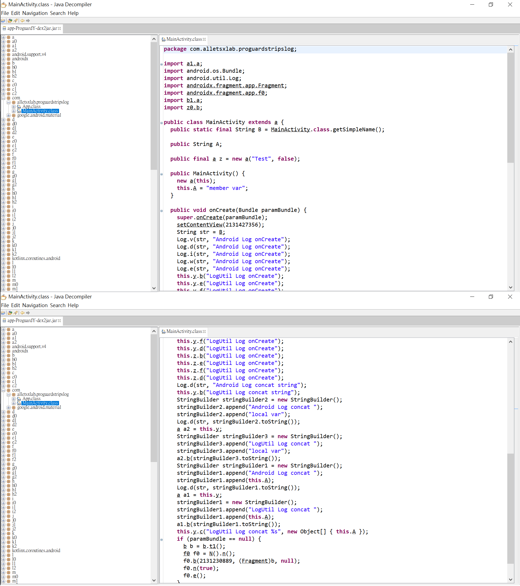

`BaseActivity`:

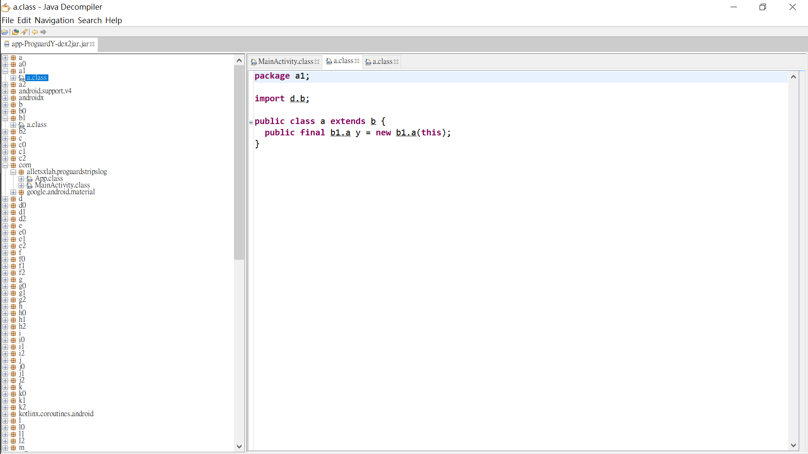

`LogUtil`:

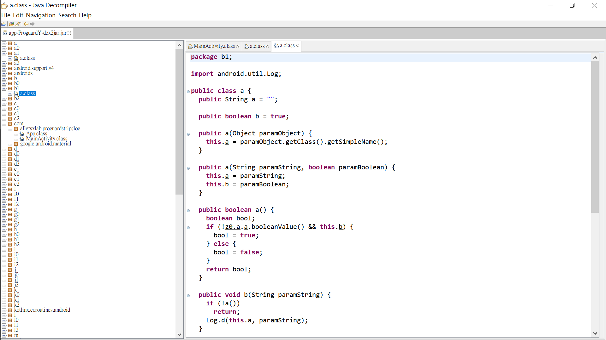


### proguard with rules

-   R8 strips all of the log statements and the custom logger instances.


`MainActivity`:

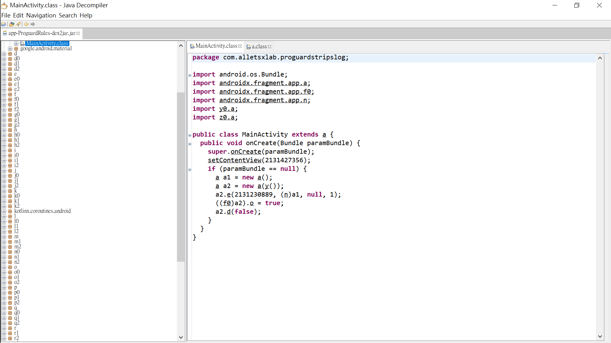

`MainActivity.onCreate()` bytecode:

```
.method public onCreate(Landroid/os/Bundle;)V
    .registers 6

    .line 1
    invoke-super {p0, p1}, Landroidx/fragment/app/p;->onCreate(Landroid/os/Bundle;)V

    const v0, 0x7f0b001c

    .line 2
    invoke-virtual {p0, v0}, Ld/h;->setContentView(I)V

    if-nez p1, :cond_27

    .line 3
    new-instance p1, Ly0/a;

    invoke-direct {p1}, Ly0/a;-><init>()V

    .line 4
    invoke-virtual {p0}, Landroidx/fragment/app/p;->y()Landroidx/fragment/app/y;

    move-result-object v0

    .line 5
    new-instance v1, Landroidx/fragment/app/a;

    invoke-direct {v1, v0}, Landroidx/fragment/app/a;-><init>(Landroidx/fragment/app/y;)V

    const v0, 0x7f0800a9

    const/4 v2, 0x0

    const/4 v3, 0x1

    .line 6
    invoke-virtual {v1, v0, p1, v2, v3}, Landroidx/fragment/app/a;->e(ILandroidx/fragment/app/n;Ljava/lang/String;I)V

    .line 7
    iput-boolean v3, v1, Landroidx/fragment/app/f0;->o:Z

    const/4 p1, 0x0

    .line 8
    invoke-virtual {v1, p1}, Landroidx/fragment/app/a;->d(Z)I

    :cond_27
    return-void
.end method
```

`BaseActivity`:

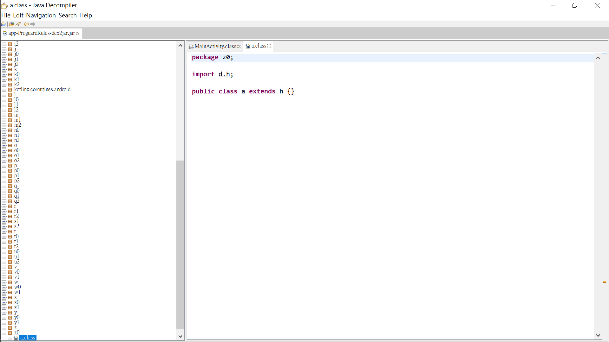

`BaseActivity` bytecode:

```
.class public Lz0/a;
.super Ld/h;
.source "SourceFile"


# direct methods
.method public constructor <init>()V
    .registers 1

    .line 1
    invoke-direct {p0}, Ld/h;-><init>()V

    return-void
.end method
```


## Kotlin

commit 9abfbb33

[MainActivity](../appkt/src/main/java/com/alletsxlab/proguardstripslog/MainActivity.kt)

[BaseActivity](../appkt/src/main/java/com/alletsxlab/proguardstripslog/base/BaseActivity.kt)

[LogUtil](../appkt/src/main/java/com/alletsxlab/proguardstripslog/utils/LogUtil.kt)


### not proguard

`MainActivity`:

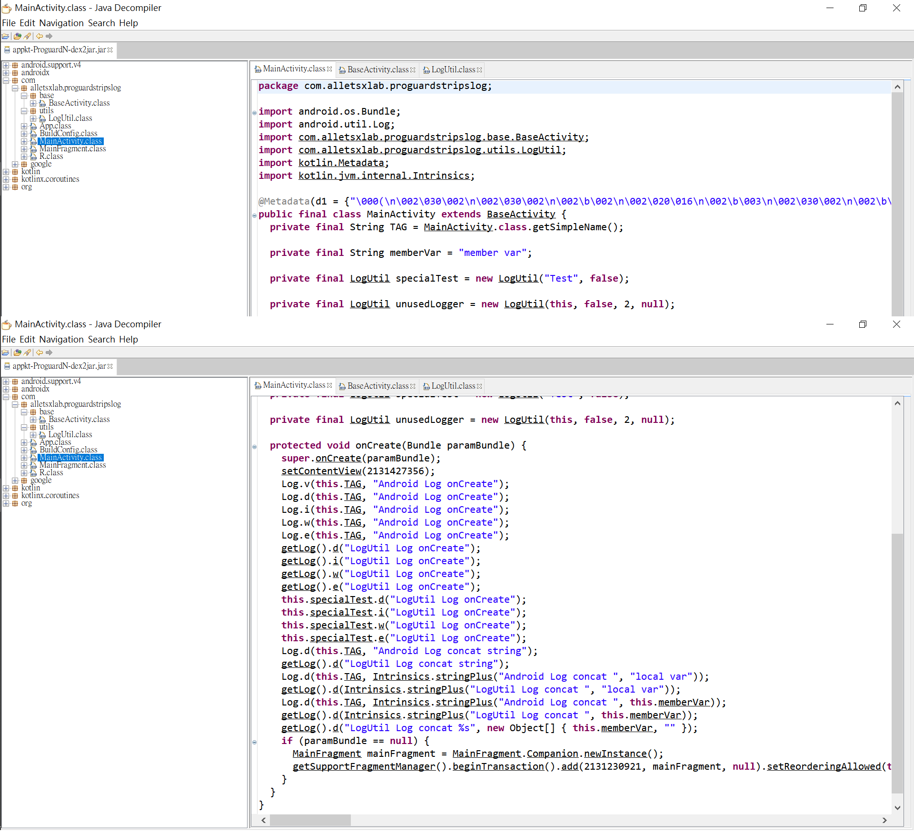

`BaseActivity`:

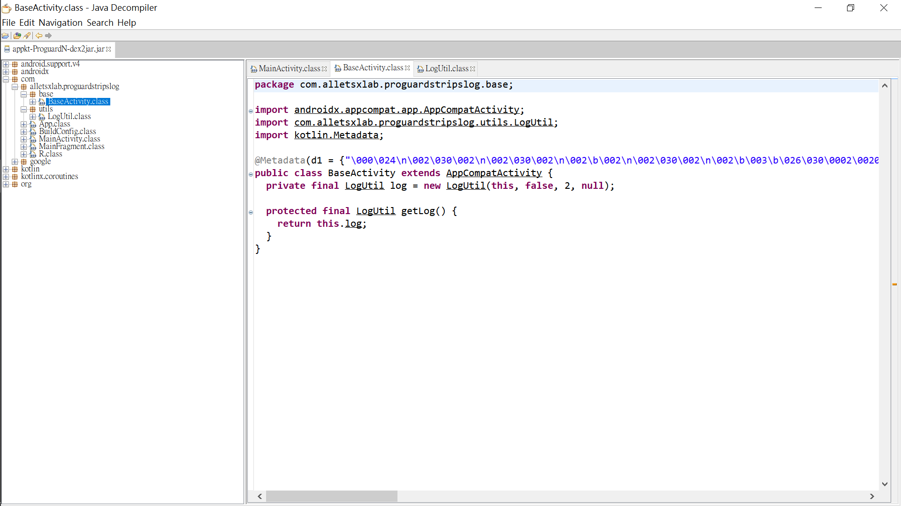

`LogUtil`:

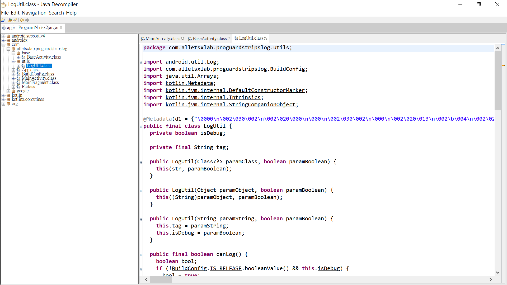


### proguard

-   R8 strips the custom logger instance `unusedLogger`.


`MainActivity`:

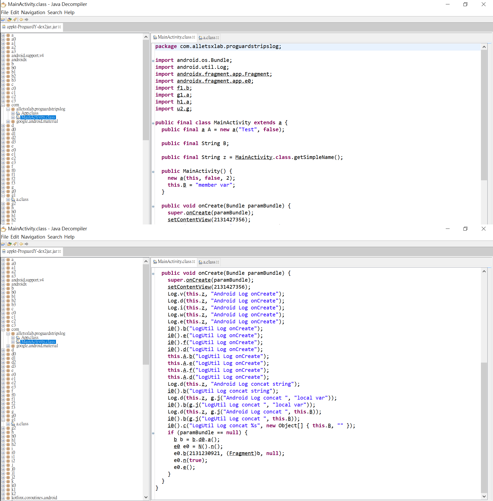

`BaseActivity`:

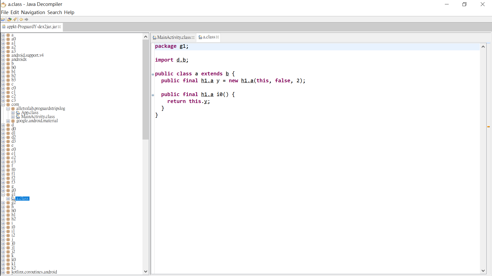

`LogUtil`:

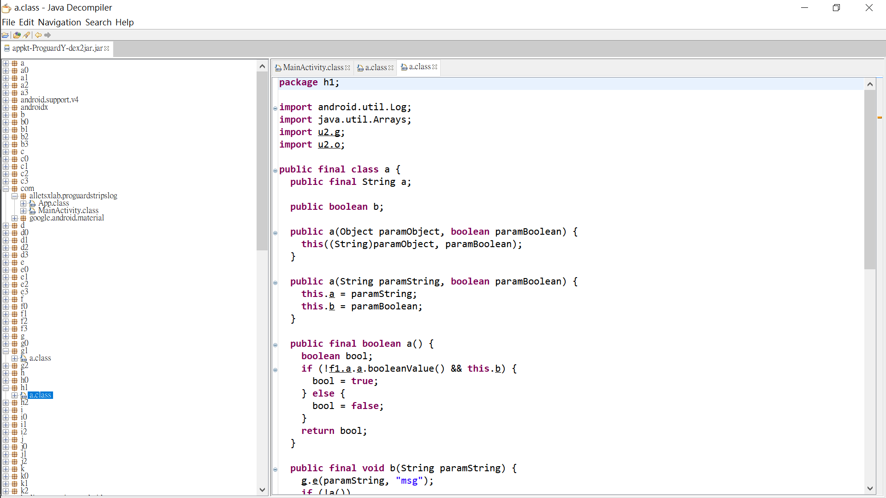


### proguard with rules

-   R8 strips most of the log statements and the custom logger instances,
	but it leaves unused string concatenation and an unused instance of the custom logger in `BaseActivity`.


`MainActivity`:

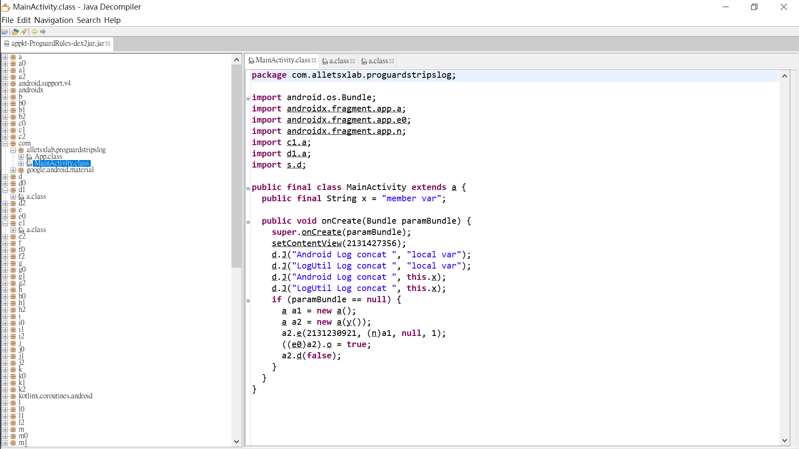

`MainActivity.onCreate()` bytecode:

```
.method public onCreate(Landroid/os/Bundle;)V
    .registers 6

    .line 1
    invoke-super {p0, p1}, Landroidx/fragment/app/o;->onCreate(Landroid/os/Bundle;)V

    const v0, 0x7f0b001c

    .line 2
    invoke-virtual {p0, v0}, Ld/h;->setContentView(I)V

    const-string v0, "Android Log concat "

    const-string v1, "local var"

    .line 3
    invoke-static {v0, v1}, Ls/d;->J(Ljava/lang/String;Ljava/lang/Object;)Ljava/lang/String;

    const-string v2, "LogUtil Log concat "

    .line 4
    invoke-static {v2, v1}, Ls/d;->J(Ljava/lang/String;Ljava/lang/Object;)Ljava/lang/String;

    .line 5
    iget-object v1, p0, Lcom/alletsxlab/proguardstripslog/MainActivity;->x:Ljava/lang/String;

    invoke-static {v0, v1}, Ls/d;->J(Ljava/lang/String;Ljava/lang/Object;)Ljava/lang/String;

    .line 6
    iget-object v0, p0, Lcom/alletsxlab/proguardstripslog/MainActivity;->x:Ljava/lang/String;

    invoke-static {v2, v0}, Ls/d;->J(Ljava/lang/String;Ljava/lang/Object;)Ljava/lang/String;

    if-nez p1, :cond_3d

    .line 7
    new-instance p1, Lc1/a;

    invoke-direct {p1}, Lc1/a;-><init>()V

    .line 8
    invoke-virtual {p0}, Landroidx/fragment/app/o;->y()Landroidx/fragment/app/x;

    move-result-object v0

    .line 9
    new-instance v1, Landroidx/fragment/app/a;

    invoke-direct {v1, v0}, Landroidx/fragment/app/a;-><init>(Landroidx/fragment/app/x;)V

    const v0, 0x7f0800c9

    const/4 v2, 0x0

    const/4 v3, 0x1

    .line 10
    invoke-virtual {v1, v0, p1, v2, v3}, Landroidx/fragment/app/a;->e(ILandroidx/fragment/app/n;Ljava/lang/String;I)V

    .line 11
    iput-boolean v3, v1, Landroidx/fragment/app/e0;->o:Z

    const/4 p1, 0x0

    .line 12
    invoke-virtual {v1, p1}, Landroidx/fragment/app/a;->d(Z)I

    :cond_3d
    return-void
.end method
```

`BaseActivity`:

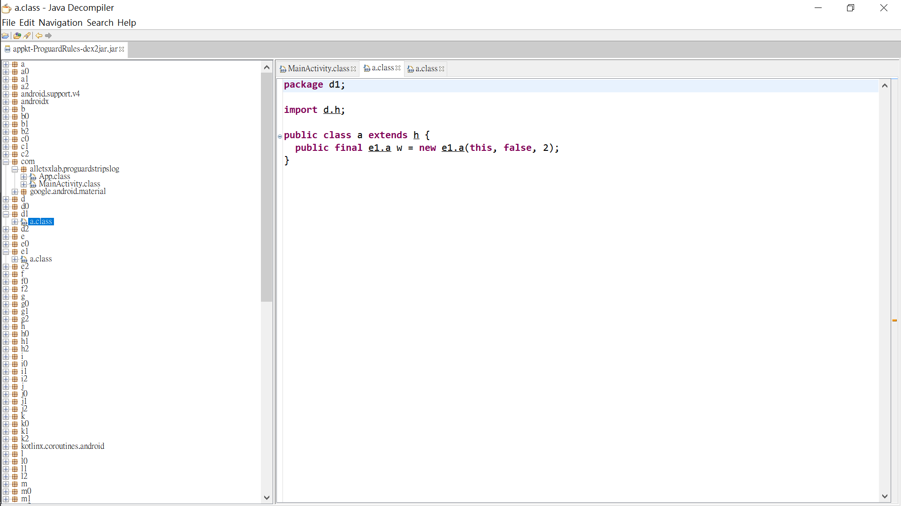

`BaseActivity` bytecode:

```
.class public Ld1/a;
.super Ld/h;
.source "SourceFile"


# instance fields
.field public final w:Le1/a;


# direct methods
.method public constructor <init>()V
    .registers 4

    .line 1
    invoke-direct {p0}, Ld/h;-><init>()V

    .line 2
    new-instance v0, Le1/a;

    const/4 v1, 0x0

    const/4 v2, 0x2

    invoke-direct {v0, p0, v1, v2}, Le1/a;-><init>(Ljava/lang/Object;ZI)V

    iput-object v0, p0, Ld1/a;->w:Le1/a;

    return-void
.end method
```

`LogUtil`:


```
.class public final Le1/a;
.super Ljava/lang/Object;
.source "SourceFile"


# instance fields
.field public a:Z


# direct methods
.method public constructor <init>(Ljava/lang/Object;ZI)V
    .registers 4

    and-int/lit8 p1, p3, 0x2

    if-eqz p1, :cond_5

    const/4 p2, 0x1

    .line 1
    :cond_5
    invoke-direct {p0}, Ljava/lang/Object;-><init>()V

    .line 2
    iput-boolean p2, p0, Le1/a;->a:Z

    return-void
.end method
```


## Java Decompiler GUI

-   d2j-dex2jar 2.1, [Luyten 0.8.2](https://github.com/ThexXTURBOXx/Luyten/releases)
	-   [Luyten 0.5.4 (The original project is NOT entirely dead. Just resting.)](https://github.com/deathmarine/Luyten)
-   d2j-dex2jar 2.1, jd-gui 1.6.6


jd-gui can not often decompile code correctly.

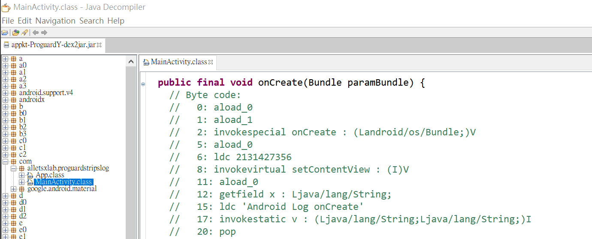

I change to mainly use Luyten 0.8.2.
It can jump to declaration, display line numbers.

More, I have tried [jadx-gui 1.4.4](https://github.com/skylot/jadx/releases).
There are more useful features to work more efficiently.
For example, it can decompile Dex to Java.
However, it does too much code restructuring to result in fidelity loss.
The following is a example of string concatenation.

```
// expected result
final StringBuilder sb = new StringBuilder();
sb.append("Android Log concat ");
sb.append("local var");
Log.d(tag, sb.toString());

// jadx-gui 1.4.4
Log.d(str, "Android Log concat local var");
```


